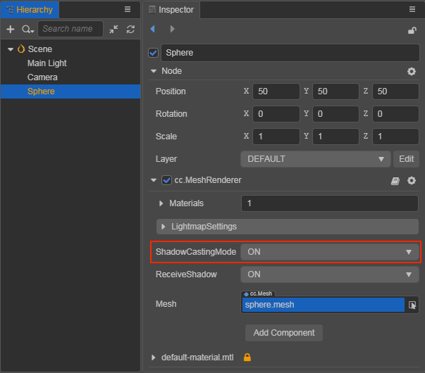
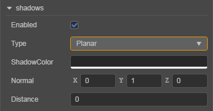
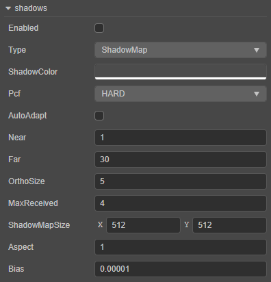

# Shadow

In the 3D world, light and shadow have always been extremely important components that enrich the entire environment. High quality shadows can make the game world look more realistic.

Creator 3.0 currently supports both **Planar** and **ShadowMap** shadow types.

## Enable Shadow Effect

To enable the shadow effect for an object, proceed as follows:

1. Check **Scene** in the **Hierarchy** panel, and then check the **Enabled** property in the **Shadows** component of the **Inspector** panel.

    

2. Select the 3D node that needs to display shadows in the **Hierarchy** panel, and then set the **ShadowCastingMode** property to **ON** in the **MeshRenderer** component of the **Inspector** panel.
    
    

    If the shadow type is **ShadowMap**, you also need to set the **ReceiveShadow** property on the **MeshRenderer** component to **ON**.

> **Note**: if the shadows are not displayed properly, you need to adjust the direction of the directional light.

## Shadow Type

The shadow type can be set in the **Type** property of the **Shadows** component.

### Planar Shadow

The Planar shadow type is generally used for simpler scenes.

| Property | Description |
| :--- | :--- |
| **Enabled** | Whether to enable shadow effect |
| **Type** | Shadow type |
| **ShadowColor** | Shadow color |
| **Normal** | The normal line perpendicular to the shadow, used to adjust the slope of the shadow |
| **Distance** | The distance of the shadow in the direction of the normal to the origin of the coordinate |

Adjust the direction of the directional light to adjust the position of the shadow.

> **Note**: planar shadows are only cast on planar surfaces, not on objects, which means that the **ReceiveShadow** property in the **MeshRenderer** component is invalid.

## ShadowMap

ShadowMap renders the scene with the light source as the viewpoint. From the position of the light source, the places in the scene that are not visible are where the shadows are created.

| Property | Description |
| :--- | :--- |
| **Enabled** | Whether to enable the shadow effect |
| **Type** | Shadow type | 
| **ShadowColor** | Shadow color |
| **Pcf** | Set the anti-aliasing level of the shadow edge, currently including **HARD**, **FILTER_X5**, **FILTER_X9**, **FILTER_X25** |
| **Near** | Set the near clip plane of the main light source camera |
| **Far** | Set the far clip plane of the main light source camera |
| **OrthoSize** | Set the orthogonal viewport size of the main light source camera |
| **ShadowMapSize** | Set the texture size of the shadow |
| **Aspect** | Set the aspect ratio of the orthogonal viewport of the main light source camera |

ShadowMap receives and displays shadow effects generated by other objects when **ReceiveShadow** on the object **MeshRenderer** component is enabled.

ShadowMap is generally used for scenes that require more realistic and complex light and shadow effects. The downside is that if the light source is not moved, then the previously generated Shadow Map can be reused, while once the light source is moved, then a new ShadowMap needs to be recalculated.
