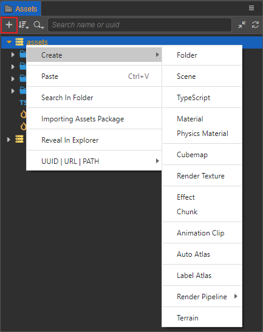
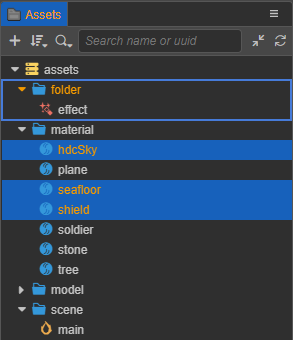

# Assets

The **Assets** panel is an important tool used to access and manage project assets. When starting to make a game, **importing assets** is usually a necessary step. Use the __Hello World__ template project as a starting point when creating a new project. After you create and open a new project, various types of assets are visible in the **Assets** panel.

## Assets Panel introduction

The **Assets** panel is the main panel. It has a **heads-up menu area**, **a central tree list area**, and a **bottom information display area**.

- The functions of the **heads-up menu area** are: **New asset button**, **Sort by button**, **Search type button**, **Search box**, **Fold or expand all button**, and **Refresh list button**.

- The **central tree list area** mainly reflects the hierarchical relationship of assets.
  - The root node is the asset root folder corresponding to the file manager of the operating system. The editor calls an __asset database__ **(DB for short)**, and is located in the project folder. It belongs to the project asset;
  - __Internal DB__ comes with the editor and provides some built-in necessary assets. It is a **read-only** asset. It cannot be **added**, **deleted**, **modified**, but **can** be **directly referenced** or **copied**.

- The __right-click__ menu of the panel is also an important function. The contents of the __right-click__ menu in different locations are different, and the unavailable menus are grayed out.

- The shortcut of the panel currently supports the operation of assets:

  - **Copy**: Ctrl or Cmd + C
  - **Paste**: Ctrl or Cmd + V
  - **Copy**: Ctrl or Cmd + D, Ctrl + drag asset
  - **Delete**: Delete
  - **Up and down selection**: up and down arrows
  - **Folder folding**: left arrow or Backspace
  - **Expand the folder**: right arrow or Enter
  - **Multi-select**: Ctrl or Cmd + click
  - **Multi-select**: Shift + click
  - **Rename**: Enter/F2
  - **Cancel Rename**: Esc

### New Assets

There are two ways to create a new asset, one is to click the **+** button at the top left of **Assets** panel. The other is to right-click in the **Assets** panel and select **Create**.

When adding a asset, an **input box** will appear. The name of the asset is required. If the input is empty, the asset will not be created. If there is no selected item in the tree list, it will be newly created on the root node of `Asset DB` by default; if there are multiple selected items, it will be newly created in the first selected item at this time.

### Selecting Assets

Use the following operations to select assets in the list:

- **Click** to **single-select assets**.
- The **up** and **down** arrows on the keyboard can be used to select.
- Hold down **Ctrl/Cmd + click** to select multiple assets.
- Hold down **Shift + click**to select multiple assets.

### Dragging Resources

Assets can also be added by dragging:

- Move the asset, drag the asset from one folder in the tree list to another folder. At this time, the location box of a target folder will follow the change.
- Drag out assets to the **Scene** panel or **Hierarchy** panel to generate nodes. Currently, `cc.Prefab`, `cc.Mesh`, `cc.SpriteFrame` assets are supported.
- Drag files from **System File Manager** to the list to import assets.
- Drag in the node and drag the node from the **Hierarchy** panel to a folder in the **Assets** panel to save the node as a `cc.Prefab` asset, see the [Prefab](../../asset/prefab.md) documentation.

 

### Deleting Assets

The **Delete** option is located in the right-click menu, or the shortcut key **Delete**, which supports batch deletion after multiple selections. After the asset is deleted, it is kept in the **system recycle bin**, and can be deleted if necessary reduction.

### Selecting All In The Folder

Right-click **Select All** in the menu to select all sub-assets in the folder.

### Searching In Folders

Right-click **Search in Folder** in the menu to narrow the search scope.

### Displaying In The File Manager

Right-click **Show in File Manager** in the menu to locate the system directory where the asset is located.

### Re-importing Assets

Right-click **Reimport Resources** in the menu to update the corresponding assets in `./library` in the project, and these generated data can be recognized by the editor and engine; support multiple selections and batch reimport.

### Sorting Assets

- The **Sort by button** in the top menu has **2** sorting methods: **Sort by name** and **Sort by type**.
- The sorting method has a memory, and the next time you open the editor, the saved sorting method will be preserved.

### Searching Assets

The search function is a combined function that can limit the search type and specify the search field.

- **Limited search type** is a major premise. **This point requires special attention**, which may cause the tree list to be empty. The button is highlighted to indicate that the function is enabled. 
  Multiple selections are possible, select `All` in the type to return to the normal tree list.

  

- There are 3 ways to specify the search field: **Search Name or UUID**, **Search UUID**, **Search UUID**. Among them, **UUID** and **UUID** can output data from the last item of the right-click menu.

  

- **Search box** changes instantly.
- Select the asset in the search results, clear the search, the window will relocate to the asset, to achieve the purpose of finding the asset through search; in addition, double-click the folder in the search result to quickly locate the folder in the tree.

### Collapsing assets

- `Head menu area` **All collapse or expand buttons** are global.
- The triangle icon of the tree node, you can press the `alt` key to expand or collapse all sub-assets.

### Renaming Assets

- Select an asset.
- Shortcut key `F2`, shortcut key `Enter`, enter name modification
- Shortcut key `Esc` to cancel rename
- In addition, the initial name of the Typescript asset will be treated as its `className`, and the `className` cannot be repeated.

### Big Picture Preview

In addition, it can be used in conjunction with the Assets Preview panel to click on a folder to display the sub-assets of the big picture arranged by type, which is more intuitive for picture assets.

