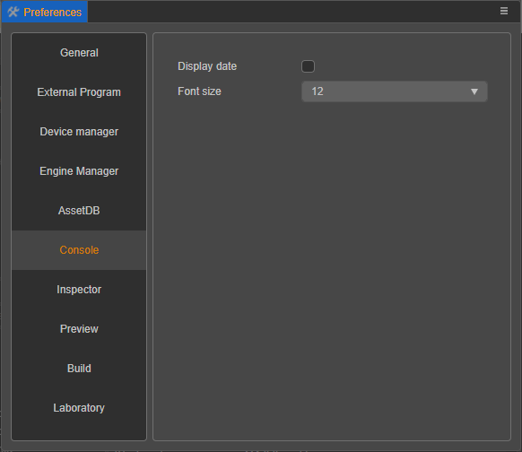

# Console


**Console** outputs editor or engine messages, including **log**, **warn**, and **error**. Different types of messages are displayed in different colors.

- `console.log()`: outputs log, <font color=#b6b6b6>gray text</font>, usually used to show what action is in progress.

  

- `console.warn()`: outputs warnings, <font color=#ebbe09>yellow text</font>, used to indicate exceptions that the developer would be wise to handle, but which will not affect operation if left unhandled.

  

- `console.error()`: outputs error, <font color=#dd3c43>red text</font>, indicating a serious error that must be resolved before proceeding to the next step or running the game.

  

## Panel operations

The top toolbar functions, in order, are:

- Clear all logs in the current console
- Enter text for fuzzy search
- Whether to convert the input text to regular for searching
- Select the type of logs to be displayed
- Open the log file backed up on disk, which will be reset each time the editor is started.

  

## Parameter settings

Some parameters of the console can be configured in **Preferences -> Console**, including whether to display the date and adjust the text size.



## Custom output information

To make it easier to locate files, nodes or assets, or to provide links to jump to help documentation, etc., Cocos Creator supports custom output to the **console** log in **Developer -> Developer Tools** in the editor's main menu, which currently supports output of the following:

- Jump to links by URL
- Show images by URL
- Locate assets by URL or UUID
- Locate nodes by UUID
- Locate script files by disk file path
- Output the text in the corresponding language

### Data format

Depending on the output content, the input data formats include the following two:

- `{type[text](url)}`
- `{type(text | url | uuid | path)}`

The data formats are described as follows:

- Matches the characters in `{}` as a whole.
- `[text]`: Text of the jump link, optional.
- `type`: The type of information to be output, including the following. The filling is case-insensitive, and if not fill in, the input is directly output without format.

    - `link`: external jump link
    - `image`: display image
    - `asset`: locate to a asset
    - `node`: locate to a node
    - `i18n`: multilingual translation

### Example

Open **Developer -> Developer Tools** in the editor's main menu, then type:

```sh
console.log('Open {link[the help doc url](https://docs.cocos.com/creator/manual/en/editor/console/)}');
console.log('Locate {link[ the file in library](D:/cocos-creator/a/library/36/36b55a90-1547-4695-8105-abd89f8a0e5f.js)}');
console.log('Locate Node UUID {node(f6zHdGKiZDhqbDizUsp8mK)}');
console.warn('Locate Asset UUID {asset(17185449-5194-4d6c-83dc-1e785375acdb)}');
console.error('Locate Asset URL {asset(db://assets/animation.anim)}');
console.log('The URL is {asset[{asset(db://assets/animation.anim)}](db://assets/animation.anim)}');
console.log('Show image {image(https://forum.cocos.org/images/logo.png)}');
console.log('Translate: {i18n(console.description)}');
```

The output log can be seen in the **Console** panel as follows:


