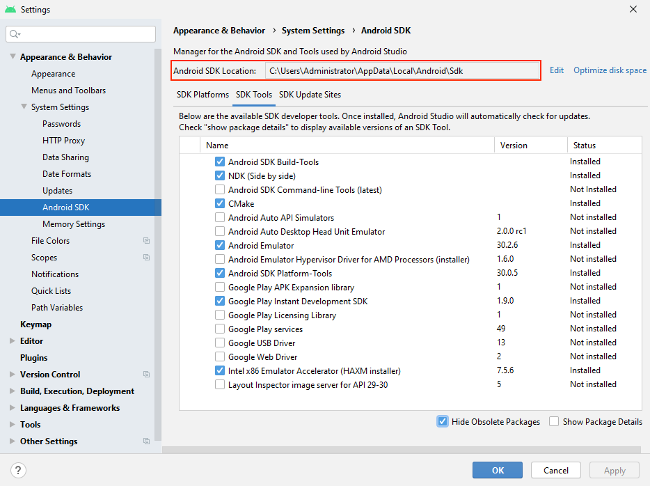
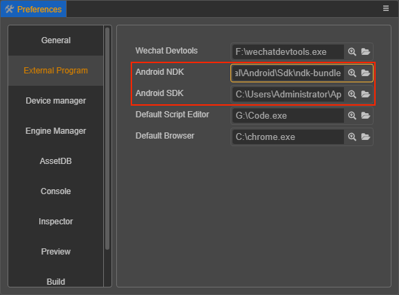

# Setup Native Development Environment

Apart from Publish games to the Web, **Cocos Creator** uses JSB technology based on the **Cocos2d-x** engine for the cross-platform release of native games. Before using **Cocos Creator** to build and publish games to native platforms, you need to configure related **Cocos2d-x** development environment first.

## Android platform dependencies

To publish to the Android platform, you need to install all of the following development environments.

If you do not have a plan to publish to the Android platform, or if your operating system already has a full Android development environment, you can skip this section.

### Download the Java SDK (JDK)

Compile the Android project requires a complete Java SDK tool on your local computer, download it at the following address:

[Java SE Development Kit 8 Downloads](http://www.oracle.com/technetwork/java/javase/downloads/jdk8-downloads-2133151.html)

Download and pay attention to select the machine and the operating system and architecture, download the installation can be completed after the installation process.

After the installation is complete, please confirm that the `java` command is valid on the command line. Input the following code into Mac terminal or Windows command line tool for check:

```bash
java -version
```

If `JAVA SE` displays, there is no problem. If `JRE` displays, then you need to install [JAVA SE running environment]((http://www.oracle.com/technetwork/java/javase/downloads/index.html)).

On Windows platform, please confirm if `JAVA_HOME` is included in your environmental variables. By right clicking **Computer** on your computer, choosing **Property -> Advanced system setting -> Environment Variables** to check and modify environmental variables. For effective running on Windows platform, you might need to restart the computer. For details, please refer to the document: [How do I set or change the PATH system variable?](https://www.java.com/en/download/help/path.xml).

### Download and install Android Studio

**Cocos Creator does not support Eclipse's ANT** build, we need to use **Android Studio v4.1 and above** as an Android platform's build tool and you should download the required SDK and NDK packages in **Android Studio**. First, install [Android Studio](https://developer.android.com/studio#downloads).

### Download the SDK and NDK required to publish the Android platform

After installing **Android Studio**, refer to the official documentation and open the **SDK Manager**: [SDK Manager Instructions](https://developer.android.com/studio/intro/update.html#sdk-manager).

1. In the **SDK Platforms** tab page, check the API level you want to install, and it is recommended to select the required mainstream API Level such as `API Level 26 (8.0)`, `API Level 28 (9.0)`, etc.
2. In the **SDK Tools** tab page, first check the lower right corner of the **Show Package Details**, show the version of the tool selection.
3. In the **Android SDK Build-Tools**, select the latest build Tools version.
4. Check the **Android SDK Platform-Tools** and **CMake**. If you need to install the **Android Support Library**, please refer to the official [Support Library Setup](https://developer.android.com/topic/libraries/support-library/setup).
5. Check the **NDK** and the recommended version is **r18~21**. Note that the **NDK-r22** is not supported currently.
6. Take note of the path of **Android SDK Location** on top of the **SDK Manager** window. Later we need to fill in the location of the SDK in **Cocos Creator**.
7. Click **OK** and follow the prompts to complete the installation.



## Install C++ compiling environment

Please install the following running environment:

- In Windows, the installation of [Visual Studio 2017/2019 Community Edition](https://www.visualstudio.com/downloads/download-visual-studio-vs) is needed. When installing Visual Studio, please check **Desktop development with C++** and **Game development with C++** two modules.

  > **Note**: there is a **Cocos** option in the **Game development with C++** module. Do **NOT** check it.

- In Mac, the installation of [Xcode](https://developer.apple.com/xcode/download/) and command line tool is needed.

  > **Note**: Starting with v3.0.1, Xcode v11.5 and above is required.

## Configure Native Develop environments path

Next, go back to Cocos Creator to configure the environmental path of the native platform. Choose **Cocos Creator -> Preferences** in the main menu, and open the **Preferences** panel. We need to configure the following two paths here:



- **Android NDK**: choose the `ndk-bundle` folder in `Android SDK Location` path we just noted in Android Studio SDK Manager window. You can skip this if you don't need to compile on Android platform.

- **Android SDK**: choose the `Android SDK Location` path we just noted in Android Studio SDK Manager window (the directory of Android SDK should include folders like `build-tools`, `platforms`, etc.). You can skip this if you don't need to compile the Android platform.

Close the window after configuration is completed.

> **Note**: the configuration will work when build native project. If the configuration not work, please try to set these settings to **System Environment** manually: `COCOS_CONSOLE_ROOT`, `NDK_ROOT`, `ANDROID_SDK_ROOT`.

## Notes

We have received lots of feedback about native packing in the public beta, and some possible reasons are supplemented here:

1. Package name issue

    Check the **Game Package Name** in the **Build** panel, including blank space, `-`, etc. are all illegal.

2. Android built successfully, but prompt `dlopen failed: cannot locate symbol "xxxx" referenced by "libcocos2djs.so"...` in runtime.

    Please check if the architecture and version of NDK and Android SDK correspond to the phone's Android system. In addition you can try to use the NDK and Android SDK version used in this article to test.

In the end, if building still fails, please send a question to the [Forum](https://discuss.cocos2d-x.org/c/33) with the Creator version, the build log file in the Build panel, and a demo that reproduces the problem.
