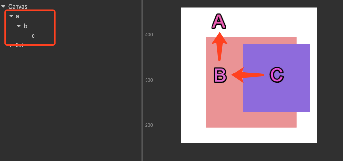
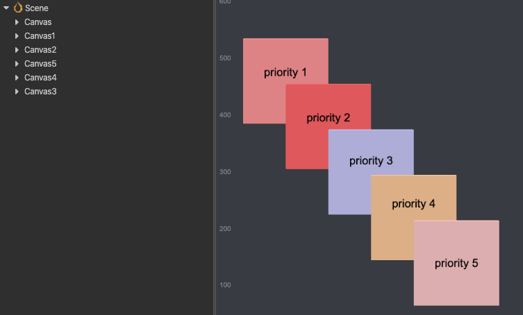
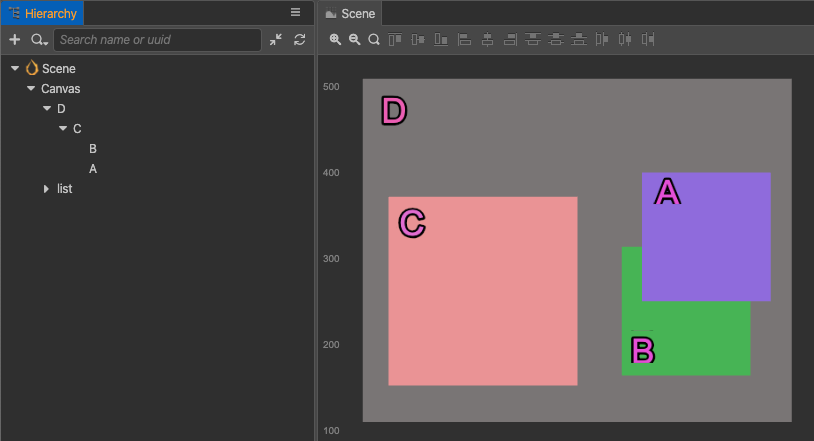

# Node System Events

`Node` has a complete set of [event listeners and dispatch mechanisms](event-emit.md). Based on this mechanism, basic system events are provided.

__Cocos Creator__ supports four types of system events: __mouse__, __touch__, __keyboard__, __device motion__. They are called [Global Events](event-input.md). The usage of touch and mouse events dispatched by `Node` is discussed in this document.

__System events__ follow the general register method, developers can register event listener not only by using the enumeration type but also by using the event name directly. It is recommended to use enumeration for event registration to avoid event registration failure due to writing problems.

```ts
// Use enumeration type to register
node.on(Node.EventType.MOUSE_DOWN, (event) => {
  console.log('Mouse down');
}, this);

// Use event name to register
node.on('mouse-down', (event) => {
  console.log('Mouse down');
}, this);
```

## Mouse event type and event object

__Mouse events__ will only be triggered on desktop platforms, the event types the system provides are as follows:

| Enumerated Object Definition   | Corresponding event Name | Timing of Event Triggering                                                                   |
|:-------------------------------|:-------------------------|:---------------------------------------------------------------------------------------------|
| __Node.EventType.MOUSE_DOWN__  | mouse-down               | When a button on the mouse is pressed in the target node region                              |
| __Node.EventType.MOUSE_ENTER__ | mouse-enter              | When the cursor enters the target node region, whether or not the button is pressed          |
| __Node.EventType.MOUSE_MOVE__  | mouse-move               | When the cursor is moved in the target node region, whether or not the button is pressed     |
| __Node.EventType.MOUSE_LEAVE__ | mouse-leave              | When the cursor is moved out of the target node region, whether or not the button is pressed |
| __Node.EventType.MOUSE_UP__    | mouse-up                 | When a button on the mouse is released                                                       |
| __Node.EventType.MOUSE_WHEEL__ | mouse-wheel              | When the mouse wheel is scrolled                                                             |

The important APIs of mouse events (`Event.EventMouse`) are described in the [Mouse Events API](event-api.md#Mouse-Event-API) (`Event` standard events API excluded).

## Touch event types and event objects

__Touch events__ can be triggered on both mobile platforms and desktop platforms. Developers can better debug on the desktop platform, by simply listening for touch events and responding to both mobile touch events and desktop mouse events at the same time. The types of touch events provided by the system are as follows:

| Enumerated Object Definition    | Corresponding Event Name | Timing of Event Triggering                                                               |
|:--------------------------------|:-------------------------|:-----------------------------------------------------------------------------------------|
| __Node.EventType.TOUCH_START__  | touch-start              | When one or more touch points are placed in the target node region                       |
| __Node.EventType.TOUCH_MOVE__   | touch-move               | When one or more touch points are moved along the screen                                 |
| __Node.EventType.TOUCH_END__    | touch-end                | When one or more touch points are removed from the screen in the target node region      |
| __Node.EventType.TOUCH_CANCEL__ | touch-cancel             | When one or more touch points are removed from the screen outside the target node region |

The important APIs of a touch event (`Event.EventTouch`) are described in the [Mouse Events API](event-api.md#Touch-Event-API) (`Event` standard event API excluded):

> __Note__: touch events support multi-touch, each touch spot will send one event to the event listener.

## Touch event propagation

### Touch event bubbles

Touch events support the event bubbles on the node tree, take the pictures below as an example:



In the scene shown in the picture, suppose node A has a child node B which has a child node C. The developer sets the touch event listeners for all these three nodes (each node has a touch event listener in examples below by default).

When the mouse or finger was applied in the node C region, the event will be triggered at node C first and the node C listener will receive the event. Then the node C will pass this event to its parent node, so the node B listener will receive this event. Similarly the node B will also pass the event to its parent node A. This is a basic event bubbling phase. It needs to be emphasized that there is no hit test in parent nodes in the bubbling phase, which means that the node A and B can receive touch events even though the touch location is out of their node region.

The bubbling phase of touch events is no different than the general events. Calling `event.propagationStopped = true;` can force to stop the bubbling phase.

### Ownership of touch points among brother nodes

Suppose the node B and C in the picture above are brother nodes, while C partly covers over B. Now if C receives a touch event, it is announced that the touch point belongs to C, which means that the brother node B won't receive the touch event any more, even though the touch location is also inside its node region. The touch point belongs to the top one among brother nodes.

At the same time, if C has a parent node, it will also pass the touch event to its parent node through the event bubble mechanism.

### Point of Contact Attribution for Different Canvas

Contact interception between different Canvas is determined by priority. In the scene in the figure below, Canvas 1-5 in the node tree corresponds to priority 1-5 of the image display. It can be seen that even though Canvas nodes 3, 4, and 5 are arranged in scrambled order, the order of response of the contacts is still __Canvas5 -> Canvas4 -> Canvas3 -> Canvas2 -> Canvas1__, according to the priority relationship on the Canvas. The sorting between Canvas is done in the order of the node tree only if the priority is the same.



### Register touch or mouse events in the capturing phase

Sometimes, it is necessary to dispatch touch or mouse events to parent node event listeners before dispatching to any child nodes beneath it in hierarchy, like the design of __ScrollView__ component.

Event bubbling cannot meet all demands. When this happens, register the parent node event listeners in the capturing phase. To achieve this goal, passing in `true` as the `useCapture` parameter (a fourth parameter) when registering touch or mouse event on the node. For example:

```ts
this.node.on(Node.EventType.TOUCH_START, this.onTouchStartCallback, this, true);
```

When the node fires the `touch-start` event, the `touch-start` event will be first dispatched to all the parent node event listeners registered in the capturing phase, then dispatched to the node itself, and finally comes the event bubbling phase.

Only touch or mouse events can be registered in the capturing phase, while the other events can't be.

### Event Interception

Normal events are dispensed as described above. However, if the node has components such as __Button__, __Toggle__ or __BlockInputEvents__ on it, it will stop event bubbling. Look at the picture below. There are two buttons, priority 1 for Canvas0 and priority 2 for Canvas1. If you click on the intersection of the two buttons, which is the blue area in the picture, it appears that button priority 2 received the contact event successfully, while button priority 1 did not. That's because according to the event reception rules above, button priority 2 receives contact events first and intercepts them（`event.propagationStopped = true`) to prevent event penetration. If the node is a non-button node, events can also be intercepted by adding the __BlockInputEvents__ component to prevent penetration.


## Example for touch events

Using the example below, summarizing touch events is easy. There are four nodes A, B, C and D in the picture above, where A and B are brother nodes. The specific hierarchical relationship should be like this:



1. If one touch is applied in the overlapping area between A and B, now B won't receive the touch event, so that propagating order of the touch event should be __A -> C -> D__.
2. If the touch location is in node B (the visible green area), the order should be __B -> C -> D__.
3. If the touch location is in node C, the order should be __C -> D__.
4. As a precondition to the second case, we register touch events on C D node in the capturing phase, then the order should be __D -> C -> B__.

## Other events of Node

All node built-in events can get event names from `Node.EventType`.

### 3D Node Events

| Enumerated Object Definition              | Corresponding Event Name             | Timing of Event Triggering             |
| :-------------             | :----------            |   :----------        |
| __TRANSFORM_CHANGED__ | transform-changed | When a transform attribute is modified, an enum value `TransformBit` is assigned that defines the modified transform based on the enum value.                      |

Definition of Transformation Enumeration Values:

| Enumeration Value Meaning | Transformations                               |
|:---------------------------|:-----------------------------------------------|
| __TransformBit.NONE__     | The properties remain unchanged.              |
| __TransformBit.POSITION__ | The node position changes.                    |
| __TransformBit.ROTATION__ | The node rotation changes.                    |
| __TransformBit.SCALE__    | The node scale changes.                       |
| __TransformBit.RS__       | The node rotation and scale change.           |
| __TransformBit.TRS__      | The node position, rotation and scale change. |

### 2D Node Events

| Enumeration Value Meaning | Corresponding Event Name | Timing of Event Triggering                                                                                              |
|:---------------------------|:--------------------------|:-------------------------------------------------------------------------------------------------------------------------|
| __SIZE_CHANGED__          | size-changed             | When the width/height property is modified. The width/height property is located on the `UITransform` component.        |
| __ANCHOR_CHANGED__        | anchor-changed           | When the X/Y properties of the anchor is modified. The width/height property is located on the `UITransform` component. |
| __COLOR_CHANGED__ | color-changed | When the color property is modified. The width/height property is located on the `UITransform` component.

## Multi-touch event

The engine has a multi-touch event blocking switch. Multi-touch events are enabled by default. For projects that do not require multi-touch, you can disable allowing multi-touch with the following code:

```ts
macro.ENABLE_MULTI_TOUCH = false;
```

Alternatively, it can be configured via __Project Setting/Macro Config__.

## Pause or resume node system events

Pause node system events

```ts
// Pause all node system events registered on the current node. Node system events include Touch and Mouse Events.
// If a parameter true is passed, the API will pause node system events on this node and all its children.
// Example
this.node.pauseSystemEvents();
```

Resume node system events

```ts
// Resume all node system events registered on the current node. Node system events include Touch and Mouse Events.
// If a parameter true is passed, the API will resume node system events on this node and all its children.
// Example
this.node.resumeSystemEvents();
```
