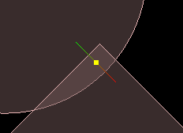
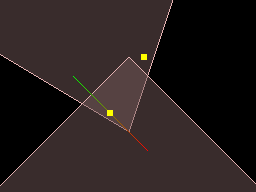

# Contact Callback

When a physics object moves in the scene and collides with other objects, __Box2D__ will handle most of the necessary collision detection and behavior. But the main point of making a physics game is what would happen when an object collides with something: such as a character encounters a monster should lead to damage taken, or when the ball hits the ground it should produce a sound.

Besides the engine tells us when a collision happens, we also need a way to get these collision information. The physics engine provides contact callback when the collision happens. In the callback we can get the information from callback argument that we can determine what happened and what action needs to be done next.

> __Notes:__
> 1. First, set `Enable contact listener` in the [Rigidbody](physics-2d-rigid-body.md) component properties. The corresponding callback will be generated.
> 2. The information in the argument of callback function is fetched from the cache of the physics engine, so the information is only accessible in the current callback. Do not store the reference to those parameters in your script, but rather copy the data to local variables for later use.
> 3. If creating a physics object (rigidbody, joint or collider) in the callback function, the corresponding __Box2D__ objects will not be created immediately along these objects. The creation of physics object will be done after a physics time step completes.

## Define a callback function

There are two ways to register a collision callback function, either through the specified collider or through a global callback function registered with the 2D physics system.

> __Note__: the built-in 2D physics module will only send `BEGIN_CONTACT` and `END_CONTACT` callback messages.

```ts
@ccclass('TestContactCallBack')
export class TestContactCallBack extends Component {
    start () {
        // Registering callback functions for a single collider
        let collider = this.getComponent(Collider2D);
        if (collider) {
            collider.on(Contact2DType.BEGIN_CONTACT, this.onBeginContact, this);
            collider.on(Contact2DType.END_CONTACT, this.onEndContact, this);
            collider.on(Contact2DType.PRE_SOLVE, this.onPreSolve, this);
            collider.on(Contact2DType.POST_SOLVE, this.onPostSolve, this);
        }

        // Registering global contact callback functions
        if (PhysicsSystem2D.instance) {
            PhysicsSystem2D.instance.on(Contact2DType.BEGIN_CONTACT, this.onBeginContact, this);
            PhysicsSystem2D.instance.on(Contact2DType.END_CONTACT, this.onEndContact, this);
            PhysicsSystem2D.instance.on(Contact2DType.PRE_SOLVE, this.onPreSolve, this);
            PhysicsSystem2D.instance.on(Contact2DType.POST_SOLVE, this.onPostSolve, this);
        }
    }
    onBeginContact (selfCollider: Collider2D, otherCollider: Collider2D, contact: : IPhysics2DContact | null) {
        // will be called once when two colliders begin to contact
        console.log('onBeginContact');
    }
    onEndContact (selfCollider: Collider2D, otherCollider: Collider2D, contact: : IPhysics2DContact | null) {
        // will be called once when the contact between two colliders just about to end.
        console.log('onEndContact');
    }
    onPreSolve (selfCollider: Collider2D, otherCollider: Collider2D, contact: : IPhysics2DContact | null) {
        // will be called every time collider contact should be resolved
        console.log('onPreSolve');
    }
    onPostSolve (selfCollider: Collider2D, otherCollider: Collider2D, contact: : IPhysics2DContact | null) {
        // will be called every time collider contact should be resolved
        console.log('onPostSolve');
    }
}

```

The above code example demonstrates how to add all the collision callback functions to a script. There are four types of callbacks, each callback function has three parameters, see [Callback parameters](#Callback-parameters) below for details. The role of each callback function is shown in the comments, and developers can implement their own callback functions according to their needs.

## Callback Order

The callback order and timing of a collision callback function can be viewed by splitting a simple example collision. Assume that two rigid bodies are moving towards each other, the triangle to the right and the box to the left, and are about to collide.


<table>
<tbody>
<tr>
Collision Procedure
</tr>
<tr>
<td style="padding:4px;width:256px;vertical-align:middle;border:1px solid black;text-align:center">
Collision 1<br>
</img>
<div style="height:4px"></div>
Collision 2<br>
</img>
<div style="height:4px"></div>
Collision 3<br>
</img>
</td>
<td style="padding:4px;border:1px solid black">
    When two colliders intersect with each other, Box2D's default behavior is to give them an impulse so that they can get away with each other. But the behavior may not be complete in a single physics cycle. As shown here, the colliders in the example will cover each other for three physics cycles until the "bounce" is complete and they are separated from each other. In this time we can customize the behavior we want. <b>onPreSolve</b> will call back each time before the physics engine processes a collision. You can modify the crash information in this callback.  <b>onPostSolve</b> will call back after the collision is processed. In this callback we can get information about the impulse of the collision as calculated by the physics engine.<br>
    The below output log shows the exact callback order of the example.
<pre>        ...
    Step
    Step
    BeginContact
    PreSolve
    PostSolve
    Step
    PreSolve
    PostSolve
    Step
    PreSolve
    PostSolve
    Step
    EndContact
    Step
    Step
    ...
</pre>
</td>
<tr>
</tbody>
</table>

## Callback parameters

The callback parameters contain all the collision contact information, and each callback function provides three parameters:

- **selfCollider**: refers to the collider on the node of the callback script.
- **otherCollider**: refers to the other collider.
- **contact**: it's an interface of the class [PhysicsContact](__APIDOC__/en/classes/physics2d.box2d.physicscontact.html). Contains the most important information about the collision. Some useful information in **contact** object are location of the collision and the normal vector. **contact** store location information according to rigidbody's local coordinate system. What we need however is information from world coordinate system. We can use `contact.getWorldManifold` to get these information. Note that the builtin physics module parameter is null.

### worldManifold

Obtaining the `worldManifold`:

```ts
const worldManifold = contact.getWorldManifold();
const points = worldManifold.points;
const normal = worldManifold.normal;
```

`worldManifold` has the following:

- __points__

  The array of contact points, they are not necessarily at the exact place where the collision happens as shown below (unless you set the rigidbody to use the bullet type, but will be more performance costing). By for general usage these points are accurate enough for us to write game logic upon.

  

  > __Note__: not every collision will have two contact points, in more simulation cases only one contact point will be produced. The following lists some other examples of the collision.

  

  

  

- __normal__

  The normal vector on the contact point is from `selfCollider` to `otherCollider`, indicating the quickest direction to resolve the collision.

  

  The lines shown in the figure is the normal vectors on the contact point. In this collision, the quickest way to solve the collision is to add the impulse to push the triangle to the top and push the box down to the right. The normal vector here is only about the direction, not with the location properties, nor with connection to any of these contact points.

  It is also necessary to understand that the **collision normal vector is not the same as the angle in which two object collides**. It will only be able to point the direction which can solve the two colliders intersecting with each other. For example, in the above example, if the triangle moves a little faster, the intersection will be shown below:

  

  Then the quickest way would be to push the triangle to the right, so using the normal vector as the direction of collision is not a good idea. To know the true direction of the collision, use the following to get the relative velocities of two colliding bodies at the point of collision when they collide with each other.

  ```ts
  const vel1 = triangleBody.getLinearVelocityFromWorldPoint(worldManifold.points[0]);
  const vel2 = squareBody.getLinearVelocityFromWorldPoint(worldManifold.points[0]);
  const relativeVelocity = vel1.sub(vel2);
  ```

### Disabling contact

```ts
contact.disabled = true;
```

Disabling the contact will cause the physics engine to ignore the contact when calculating the collision. Disabling will continue until the collision is completely resolved unless the contact is enabled in other callbacks.

To disable contact in the current time step, use `disabledOnce`。

```ts
contact.disabledOnce = true;
```

### Modify contact information

To modify the contact information in **onPreSolve** because **onPreSolve** is called before the physics engine handles the contact information. Changes to the contact information will affect the subsequent collision calculations.

```ts
// Modify the friction between the collision bodies
contact.setFriction(friction);

// Modify the elasticity of the collision body
contact.setRestitution(restitution);
```

> __Note__: these changes will only take effect within the current time step.
