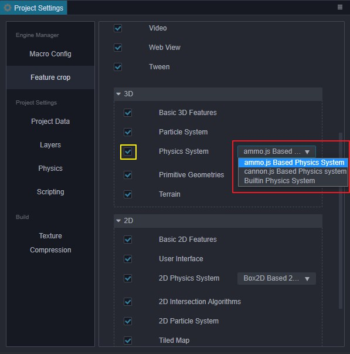

# Choosing The Physics System Suitable For Your Project

In the panel **Project -> Project Settings -> Module Options** of the Editor, you can choose a physics engine suitable for the needs of the project for development.

> **Notes**:
> 1. The default is `ammo.js` physics engine.
> 2. The physics engine can be switched at will during development.

## Collision Detection: builtin

__builtin__ only has the function of collision detection. Compared with other physics engines, it has no complicated physical simulation calculations. If your project does not require the physical simulation of this part, you can consider using __builtin__, which will make the size of game's package smaller.

If you use __builtin__ for development, please note the following:

- __builtin__ only has events of type __trigger__.
- __isTrigger__ in __Collider__ component is a trigger regardless of whether the value is true or false.

## Physics Engine: cannon.js

[cannon.js](https://github.com/cocos-creator/cannon.js) is an open source physics engine, which uses js language to develop and implement more comprehensive physics functions, if your project needs more complex physical functions, then you can consider using [cannon.js](https://github.com/cocos-creator/cannon.js). The size of the __cannon.js__ module is __141KB__.

## Physics Engine: ammo.js

[ammo.js](https://github.com/cocos-creator/ammo.js) is the __asm.js__/__wasm__ Version of the [bullet](https://github.com/bulletphysics/bullet3) physics engine, it is compiled by [emscripten](https://github.com/emscripten-core/emscripten) tool. Bullet has perfect physical functions, and we will put more work here in the future.

It should be noted that currently the __ammo.js__ module has a size of about __1.5MB__.

## Do Not Use Physics

If you don't need to use any physics related components and interfaces, you can uncheck the yellow box, so that you can get a smaller package when publishing.

> **Note**: if it is unchecked, the project will not be able to use physics related components and interfaces, otherwise an error will be reported during runtime.

<!-- ## Expand the physical backend -->
