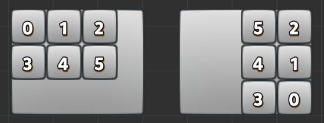

# Auto Layout Container

The __Layout__ component can be mounted to any __Node__, making the node into a container with the auto layout function. The so-called auto layout container can automatically array the child nodes according to certain rules and adjust the container type nodes of its own size according to the sum total of bounding boxes of the node content.

For the next layout types, the node structure is as follows:

## Layout Type

Auto layout components have several basic layout types. These can be set up by the `Layout Type` property, which includes the following types.

### Horizontal Layout

When Layout `Type` is set to `Horizontal`, all child nodes will be automatically aligned horizontally and the component will modify the position or height of the node on the y-axis by default. If the child node needs to be placed outside the height range of the Layout node's bounding box, you can uncheck `AutoAlignment` (as shown above).

The situation that the content exceeds the container easily under horizontal sorting, the following measures can be taken as needed.

  - If the container is to adapt to the size of the content, you can set the `ResizeMode` to `Container`, which will set the width of the Layout node based on the sum of the widths of the child nodes (`Width`) (left in the figure below).

  - If the content object is always to remain inside the container, you can set `ResizeMode` to `Children`, which will limit the size of the content object to the container (right in the figure below).

  - If you want the child nodes to be aligned upwards on the y-axis, you can add a widget component to the child node and turn on the `Top` or `Bottom` alignment mode.

#### Horizontal Direction

In the horizontal layout, you can set the horizontal orientation with `HorizontalDirection`. There are two types of orientation: `LEFT_TO_RIGHT` and `RIGHT_TO_LEFT`. The former will arrange the nodes from left to right according to their display order in __Hierarchy__. The latter will arrange the nodes from right to left according to their display order.

### Vertical Layout

The layout and orientation of vertical layout is almost the same as __horizontal layout__, only the orientation is different.

### Grid Layout

Layout `Type` set to `Grid` will start the grid layout. The grid layout will determine the starting point of the layout based on the combination of `HorizontalDirection` and `VerticalDirection` within a fixed container size, and the layout direction based on the `StartAxis` property.

#### Grid Direction

Layout arranges the child nodes in the order in which they are displayed in the __Hierarchy__, plus the start point and the alignment direction set by the `StartAxis` property.

- Start axis
  - Set to either `HORIZONTAL` or `VERTICAL` orientation. The former will be aligned horizontally, the latter vertically.
- Start point
  - The start point is created by combining `HorizontalDirection` and `VerticalDirection`.
  - Suppose `HorizontalDirection` is `LEFT_TO_RIGHT` and VerticalDirection is `TOP_TO_BOTTOM`, then the start point is __top left__.
  - Suppose `HorizontalDirection` is `RIGHT_TO_LEFT` and VerticalDirection is `BOTTOM_TO_TOP`, then the start point is __bottom right__.

Two examples are given in conjunction with alignment directions:

- If the `HorizontalDirection` is set to `LEFT_TO_RIGHT`, `VerticalDirection` is `TOP_TO_BOTTOM` and `StartAxis` is `HORIZONTAL`. This tells the component to be sorted horizontally starting from the __top left__ of the container (below left).

- If the currently set `HorizontalDirection` is `RIGHT_TO_LEFT`, VerticalDirection is `BOTTOM_TO_TOP` and `StartAxis` is `VERTICAL`, it is telling the component to be sorted vertically starting from the __BOTTOM RIGHT__ of the container (right in the figure below).

  

Grid sorting may also cause the content to exceed the container, which can also be solved by using the `Children` and `Container` modes of `ResizeMode` mentioned in `Horizontal Layout`.

For more information, please refer to the [Layout component](../editor/layout.md) documentation.
