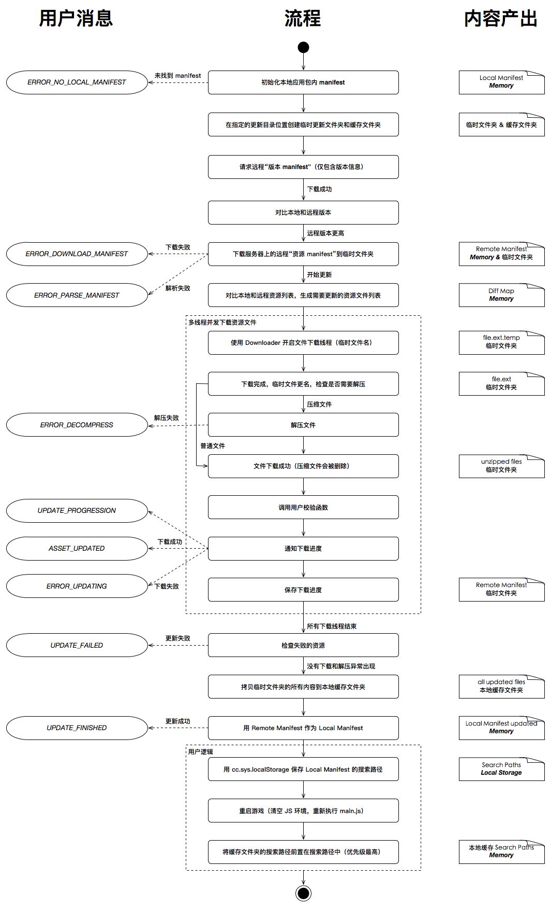
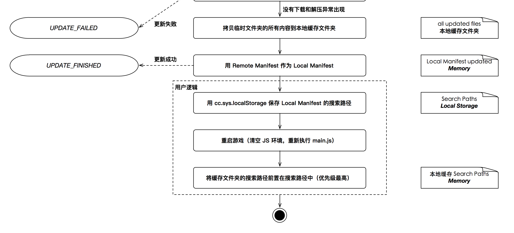
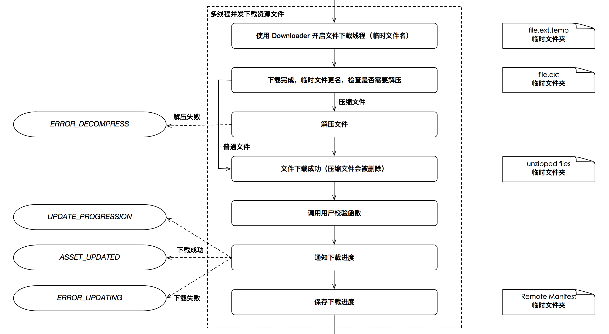

# 热更新管理器 AssetsManager

这篇文档将全面覆盖热更新管理器 AssetsManager 的设计思路，技术细节以及使用方式。由于热更新机制的需求对于开发者来说可能各不相同，在维护过程中开发者也提出了各个层面的各种问题，说明开发者需要充分了解热更新机制的细节才能够定制出符合自己需要的工作流。所以这篇文档比较长，也尽力循序渐进得介绍热更新机制，但是并不会介绍过多使用层面的代码，对于想要先了解具体如何使用热更新机制来更新自己游戏的开发者，可以先尝试我们提供的一个 [简易教程](hot-update.md)。

## 资源热更新简介

资源热更新是为游戏运行时动态更新资源而设计的，这里的资源可以是图片，音频甚至游戏逻辑。在游戏漫长的运营维护过程中，你将可以上传新的资源到你的服务器，让你的游戏跟踪远程服务器上的修改，自动下载新的资源到用户的设备上。就这样，全新的设计，新的游玩体验甚至全新的游戏内容都将立刻被推送到你的用户手上。重要的是，你不需要针对各个渠道去重新打包你的应用并经历痛苦的应用更新审核！

资源热更新管理器经历过三个重要的阶段：

1. 在 Cocos2d-JS v3.0 中初次设计并实现。
2. 在 Cocos2d-x v3.9 中升级了 Downloader 和多线程并发实现。
3. 在 Cocos Creator v1.4.0 和 Cocos2d-x v3.15 中经过一次重大重构，系统性解决了热更新过程中的 bug。

所以请配合使用最新版本的引擎来使用，这篇文档也是基于最后一次重构来编写的。

## 设计目标和基本原理

热更新机制本质上是从服务器下载需要的资源到本地，并且可以执行新的游戏逻辑，让新资源可以被游戏所使用。这意味着两个最为核心的目标：下载新资源，覆盖使用新逻辑和资源。同时，由于热更新机制最初在 Cocos2d-JS 中设计，我们考虑了什么样的热更新机制才更适合 Cocos 的 JavaScript 用户群。最终我们决定使用类似 Web 网页的更新模式来更新游戏内容，我们先看一下 Web 的更新模式：

1. Web 页面在服务端保存完整的页面内容
2. 浏览器请求到一个网页之后会在本地缓存它的资源
3. 当浏览器重新请求这个网页的时候会查询服务器版本的最后修改时间（Last-Modified）或者是唯一标识（Etag），如果不同则下载新的文件来更新缓存，否则继续使用缓存

浏览器的缓存机制远比上面描述的要复杂，不过基本思路我们已经有了，那么对于游戏资源来说，也可以在资源服务器上保存一份完整的资源，客户端更新时与服务端进行比对，下载有差异的文件并替换缓存。无差异的部分继续使用包内版本或是缓存文件。这样我们更新游戏需要的就是：

1. 服务端保存最新版本的完整资源（开发者可以随时更新服务器）
2. 客户端发送请求和服务端版本进行比对获得差异列表
3. 从服务端下载所有新版本中有改动的资源文件
4. 用新资源覆盖旧缓存以及应用包内的文件

这就是整个热更新流程的设计思路，当然里面还有非常多具体的细节，后面会结合实际流程进行梳理。这里需要特别指出的是：

**Cocos 默认的热更新机制并不是基于补丁包更新的机制，传统的热更新经常对多个版本之间分别生成补丁包，按顺序下载补丁包并更新到最新版本。Cocos 的热更新机制通过直接比较最新版本和本地版本的差异来生成差异列表并更新**。这样即可天然支持跨版本更新，比如本地版本为 A，远程版本是 C，则直接更新 A 和 C 之间的差异，并不需要生成 A 到 B 和 B 到 C 的更新包，依次更新。所以，在这种设计思路下，新版本的文件以离散的方式保存在服务端，更新时以文件为单位下载。

## 热更新基本流程

在理解了上面基本的设计思路之后，我们来看一次典型的热更新流程。我们使用 manfiest 资源描述文件来描述本地或远程包含的资源列表及资源版本，manifest 文件的定义会在后面详述。运行环境假定为用户安装好 app 后，第一次检查到服务端的版本更新：



上图分为三个部分，中间是热更新的流程，左边是更新过程中 AssetsManager 向用户发送的消息，右边则是各个步骤产出的中间结果，其中粗体字表示中间结果所在的位置，比如内存中、临时文件夹中或者是缓存文件夹。

相信看完这张图还是有很多疑问，下面会从细节上来解析各个步骤中需要注意或者不容易理解的地方。

## 技术细节解析

### Manifest 格式

Manifest 格式是我们用来比较本地和远程资源差异的一种 json 格式，其中保存了主版本信息、引擎版本信息、资源列表及资源信息等：

```
{
    "packageUrl" :          远程资源的本地缓存根路径
    "remoteVersionUrl" :    [可选项] 远程版本文件的路径，用来判断服务器端是否有新版本的资源
    "remoteManifestUrl" :   远程资源 Manifest 文件的路径，包含版本信息以及所有资源信息
    "version" :             资源的版本
    "engineVersion" :       引擎版本
    "assets" :              所有资源列表
        "key" :             资源的相对路径（相对于资源根目录）
        "md5" :             md5 值代表资源文件的版本信息
        "compressed" :      [可选项] 如果值为 true，文件被下载后会自动被解压，目前仅支持 zip 压缩格式
        "size" :            [可选项] 文件的字节尺寸，用于快速获取进度信息
    "searchPaths" :         需要添加到 FileUtils 中的搜索路径列表
}
```

Manifest 文件可以通过 Cocos Creator 热更新范例中的 `version_generator.js`（[GitHub](https://github.com/cocos-creator/tutorial-hot-update/blob/master/version_generator.js) | [Gitee](https://gitee.com/mirrors_cocos-creator/tutorial-hot-update/blob/master/version_generator.js)）来自动生成。

这里需要注意的是，remote 信息（包括 `packageUrl`、`remoteVersionUrl`、`remoteManifestUrl`）是该 manifest 所指向远程包信息，也就是说，当这个 manifest 成为本地包或者缓存 manifest 之后，它们才有意义（偷偷透露个小秘密，更新版本时更改远程包地址也是一种玩法呢）。另外，md5 信息可以不是文件的 md5 码，也可以是某个版本号，这完全是由用户决定的，本地和远程 manifest 对比时，只要 md5 信息不同，我们就认为这个文件有改动。

### 工程资源和游戏包内资源的区别

大家在创建一个 Cocos Creator 工程的时候，可以看到它的目录下有 assets 目录，里面保存了你的场景、脚本、prefab 等，对应编辑器中的**资源管理器**面板。但是这些工程资源并不等同于打包后的资源，在使用**构建发布**面板构建原生版本时，我们会在构建目录下找到 assets 和 src 文件夹，这两个文件夹内保存的才是真正让游戏运行起来的游戏包内资源。其中 src 包含引擎脚本，assets 包含其他资源。

所以我们的资源热更新自然应该更新构建出来的资源，而不是工程的 assets 目录。

### 包内资源、本地缓存资源和临时资源

在开发者的游戏安装到用户的手机上时，它的游戏是以 .ipa（iOS）或者 .apk（Android）形式存在的，这种应用包在安装后，它的内容是无法被修改或者添加的，应用包内的任何资源都会一直存在。所以热更新机制中，我们只能更新本地缓存到手机的可写目录下（应用存储空间或者 SD 卡指定目录），并通过 FileUtils 的搜索路径机制完成本地缓存对包内资源的覆盖。同时为了保障更新的可靠性，我们在更新过程中会首先将新版本资源放到一个临时文件夹中，只有当本次更新正常完成，才会替换到本地缓存文件夹内。如果中途中断更新或者更新失败，此时的失败版本都不会污染现有的本地缓存。这一步骤在上一章节的流程图中有详细介绍：



在长期多次更新的情况下，本地缓存会一直被替换为最新的版本，而应用包只有等到用户在应用商店中更新到新版本才会被修改。

### 进度信息

在前面章节的流程图中，可以看到热更新管理器有发送 `UPDATE_PROGRESSION` 消息给用户。目前版本中，用户可以接收到下面进度信息：

1. 字节级进度（百分比）
2. 文件级进度（百分比）
3. 已接收到的字节数
4. 总字节数
5. 已接收到的文件数
6. 总文件数

```js
function updateCb (event) {
    switch (event.getEventCode())
    {
        case jsb.EventAssetsManager.UPDATE_PROGRESSION:
            cc.log("Byte progression : " + event.getPercent() / 100);
            cc.log("File progression : " + event.getPercentByFile() / 100);
            cc.log("Total files      : " + event.getTotalFiles());
            cc.log("Downloaded files : " + event.getDownloadedFiles());
            cc.log("Total bytes      : " + event.getTotalBytes());
            cc.log("Downloaded bytes : " + event.getDownloadedBytes());
            break;
    }
}
```

### 断点续传

肯定有开发者会问，如果在更新过程中网络中断会怎么样？答案是热更新管理器支持断点续传，并且同时支持文件级别和字节级别的断点续传。

那么具体是怎么做的呢？首先我们使用 Manifest 文件来标识每个资源的状态，比如未开始、下载中、下载成功，在热更新过程中，文件下载完成会被标识到内存的 Manifest 中，当下载完成的文件数量每到一个进度节点（默认以 10% 为一个节点）都会将内存中的 Manifest 序列化并保存到临时文件夹中。具体的步骤展示在流程图多线程并发下载资源部分：



在中断之后，再次启动热更新流程时，会去检查临时文件夹中是否有未完成的更新，校验版本是否和远程匹配后，则直接使用临时文件夹中的 Manifest 作为 Remote Manifest 继续更新。此时，对于下载状态为已完成的，不会重新下载，对于下载中的文件，会尝试发送续传请求给服务器（服务器需要支持 `Accept-Ranges`，否则从头开始下载）。

### 控制并发

热更新管理器提供了控制下载并发数量的 API，使用方式如下：

```js
assetsManager.setMaxConcurrentTask(10);
```

### 版本对比函数

热更新流程中很重要的步骤是比较客户端和服务端的版本，默认情况下只有当服务端主版本比客户端主版本更新时才会去更新。引擎中实现了一个支持 x.x.x.x 四个序列版本的对比函数（x 为纯数字），不符合这种版本号模式的情况下会继续使用字符串比较函数。

除此之外，我们还允许用户使用自己的版本对比函数，使用方法如下：

```js
// versionA 和 versionB 都是字符串类型
assetsManager.setVersionCompareHandle(function (versionA, versionB) {
    var sub = parseFloat(versionA) - parseFloat(versionB);
    // 当返回值大于 0 时，versionA > versionB
    // 当返回值等于 0 时，versionA = versionB
    // 当返回值小于 0 时，versionA < versionB
    return sub;
});
```

### 下载后文件校验

由于下载过程中仍然有小概率可能由于网络原因或其他网络库的问题导致下载的文件内容有问题，所以我们提供了用户文件校验接口，在文件下载完成后热更新管理器会调用这个接口（用户实现的情况下），如果返回 true 表示文件正常，返回 false 表示文件有问题。

```js
assetsManager.setVerifyCallback(function (filePath, asset) {
    var md5 = calculateMD5(filePath);
    if (md5 === asset.md5)
        return true;
    else 
        return false;
});
```

由于 Manifest 中的资源版本建议使用 md5 码，那么在校验函数中计算下载文件的 md5 码去和 asset 的 md5 码对比即可判断文件是否正常。除了 md5 信息之外，asset 对象还包含下面的属性：

| 属性   | 说明 |
| :---- | :---- |
| path          | 服务器端相对路径 |
| compressed    | 是否被压缩 |
| size          | 文件尺寸 |
| downloadState | 下载状态，包含 `UNSTARTED`、`DOWNLOADING`、`SUCCESSED`、`UNMARKED` |

### 错误处理和失败重试

在流程图的左侧，大家应该注意到了不少的用户消息，这些用户消息都是可以通过热更新的事件监听器来获得通知的，具体可以参考 **范例**（[GitHub](https://github.com/cocos-creator/tutorial-hot-update/blob/master/assets/hotupdate/HotUpdate.ts) | [Gitee](https://gitee.com/mirrors_cocos-creator/tutorial-hot-update/blob/master/assets/hotupdate/HotUpdate.ts)）。流程图标识了所有错误信息的触发时机和原因，开发者可以根据自己的系统设计来做出相应的处理。

最重要的就是当下载过程中出现异常，比如下载失败、解压失败、校验失败，最后都会触发 `UPDATE_FAILED` 事件。而所有下载失败的资源列表会被记录在热更新管理器中，可以通过以下方式下载重试：

```js
assetsManager.downloadFailedAssets();
```

这个接口调用之后，会重新进入热更新流程，仅下载之前失败的资源。该流程和正常的热更新流程是一致的。

### 重启的必要性

如果要使用热更新之后的资源，需要重启游戏。有两个原因，第一是更新之后的脚本需要干净的 JS 环境才能正常运行。第二是场景配置，AssetManager 中的配置都需要更新到最新才能够正常加载场景和资源。

1. JS 脚本的刷新
    
    在热更新之前，游戏中的所有脚本已经执行过了，所有的类、组件、对象已经存在 JS context 中。所以热更新之后如果不重启游戏就直接加载脚本，同名的类和对象虽然会被覆盖，但是之前旧的类创建的对象是一直存在的。而被直接覆盖的全局对象，原先的状态也被重置了，就会导致新版本和旧版本的对象混杂在一起。并且对内存也会造成额外开销。

2. 资源配置的刷新

    因为 Creator 的场景和资源都依赖于 [Asset Bundle](https://docs.cocos.com/creator/3.0/manual/en/asset/bundle.html) 。如果 Asset Bundle 没有被重新加载，并被 [Asset Manager](https://docs.cocos.com/creator/3.0/manual/en/asset/asset-manager.html) 重新读取，那么游戏中是加载不到热更新后的场景和资源的。

而如何启用新的资源，就需要依赖 Cocos 引擎的搜索路径机制了。Cocos 中所有文件的读取都是通过 FileUtils，而 FileUtils 会按照搜索路径的优先级顺序查找文件。所以我们只要将热更新的缓存目录添加到搜索路径中并且前置，就会优先搜索到缓存目录中的资源。以下是示例代码：

```js
if (jsb) {
    // 创建 AssetsManager
    var assetsManager = new jsb.AssetsManager(manifestUrl, storagePath);
    // 初始化后的 AssetsManager 的 local manifest 就是缓存目录中的 manifest
    var hotUpdateSearchPaths = assetsManager.getLocalManifest().getSearchPaths();
    // 默认的搜索路径
    var searchPaths = jsb.fileUtils.getSearchPaths();

    // hotUpdateSearchPaths 会前置在 searchPaths 数组的开头
    Array.prototype.unshift.apply(searchPaths, hotUpdateSearchPaths);

    jsb.fileUtils.setSearchPaths(searchPaths);
}
```

需要注意的是，这段代码必须放在 `main.js` 中 require 其他脚本之前执行，否则还是会加载到应用包内的脚本。

## 进阶主题

上面的章节介绍了热更新管理器的大部分实现和使用细节，应该可以解答开发者的大多数疑问。不过在一些特殊的应用场景下，可能需要一些特殊的技巧来避免热更新引发的问题。

### 迭代升级

对于游戏开发者来说，热更新是比较频繁的需求，从一个大版本升级到另一个大版本的过程中，中间可能会发布多个热更新版本。那么下面两个问题是开发者比较关心的：

1. 在本地缓存覆盖过程中会发生什么问题

    当用户环境中已经包含一个本地缓存版本时，热更新管理器会比较缓存版本和应用包内版本，使用较新的版本作为本地版本。如果此时远程版本有更新，热更新管理器在更新过程中，按照正常流程会使用临时文件夹来下载远程版本。当远程版本更新成功后，临时文件夹中的内容会被复制到本地缓存文件夹中。如果本地缓存文件夹中有同名文件则直接覆盖，而其他文件则保留，因为这些文件仍然可能是有效的，只是它们没有在这次版本中被修改。最后删除临时文件夹。

    所以理论上小版本的持续热更新不会遇到什么问题。

2. 游戏大版本更新过程中，如何清理本地缓存

    在游戏包更新过程中，若要彻底清理本地的热更新缓存有很多种做法，比如可以记录当前的游戏版本号，检查与 `cc.sys.localStorage` 中保存的版本是否匹配，如果两者不匹配则执行以下清理操作：

    ```js
    // 之前保存在 local Storage 中的版本号，如果没有，则认为是新版本
    var previousVersion = parseFloat( cc.sys.localStorage.getItem('currentVersion') );
    // game.currentVersion 为当前版本的版本号
    if (previousVersion < game.currentVersion) {
        // 热更新的储存路径，如果旧版本中有多个，可能需要记录在列表中，全部清理
        jsb.fileUtils.removeDirectory(storagePath);
    }
    ```

### 更新引擎

升级游戏使用的引擎版本可能会对热更新产生巨大影响，开发者们可能有注意到在原生项目中存在 `src/cocos-js/cc.js` 文件，这个文件是 JS 引擎编译出来的。在不同版本的引擎中，它的代码会产生比较大的差异，而 C++ 底层也会随之发生一些改变。这种情况下，如果游戏包内的 C++ 引擎版本和 `src/cocos-js/cc.js` 的引擎版本不一致，可能会导致严重的问题，甚至游戏完全无法运行。

建议更新引擎之后，尽量推送大版本到应用商店。如果仍采用热更新方案，请一定要仔细完成各个旧版本更新到新版本的测试。
