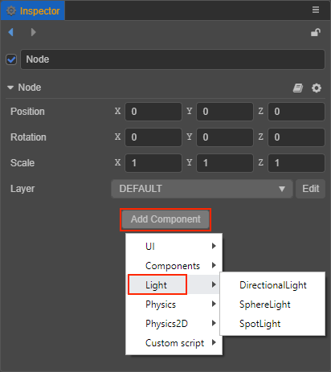

# 光照

光源在游戏中表示具备发光能力的物体，在场景中添加光源可以使场景产生相应的光照和阴影效果，获得更好的视觉效果。

## 添加光源

添加光源有以下两种方式：

- 在 **层级管理器** 中点击左上角的 **+** 按钮，选择 **光源**，然后根据需要选择光源类型就可以创建一个带有对应类型 **光源组件** 的节点到场景中。

  

- 在 **层级管理器** 中选择需要添加光源的节点，然后点击 **属性检查器** 下方的 **添加组件** 按钮，选择 **Light**，即可选择所需的光源组件到节点上。

  

## 基于物理的光照

Cocos Creator 中采用光学度量单位来描述光源参数。基于光学度量单位，我们可以将光源的相关参数全部转化为真实世界中的物理值。这样，设计人员可根据相关灯光的工业参数以及真实环境的实际物理参数来调节光照强度、颜色、范围等信息，使整体光照效果更加符合真实的自然环境。

具体内容可参考 [基于物理的光照](light/pbr-lighting.md)。

## 光源类型

光源类型目前包括 **方向光**、**球面光**、**聚光灯**、**环境光** 四种，详情可参考下方文档：

- [方向光](light/dir-light.md)
- [球面光](light/sphere-light.md)
- [聚光灯](light/spot-light.md)
- [环境光](./ambient.md)
