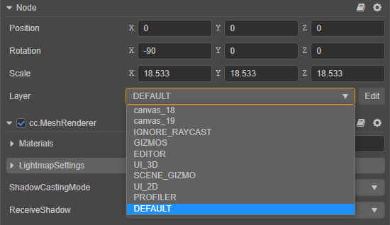

# 节点和组件

Cocos Creator 3.0 的工作流程是以组件式开发为核心的，组件式架构也称作 **实体 — 组件架构**（Entity-Component System），简单来说，就是以组合而非继承的方式进行游戏中各种元素的构建。

在 Cocos Creator 3.0 中，**节点（Node）** 是承载组件的实体，我们通过将具有各种功能的 **组件（Component）** 挂载到节点上，来让节点具有各式各样的表现和功能。接下来我们看看如何在场景中创建节点和添加组件。

## 节点

节点是场景的基础组成单位。节点之间是树状的组织关系，每个节点可以有多个子节点：

节点具有以下特性：
- 节点包含一组基础属性（位移、旋转、缩放），节点之间通过一组相对变换关系组织在一起，详情可参考 [坐标系和变换](./coord.md)。
- 节点间的更新顺序是逐级更新的。子节点的更新依赖于父节点，子节点跟随父节点变换
- 节点上可以添加组件，将多个组件与节点关联在一起

### 创建节点（Node）

要最快速地获得一个具有特定功能的节点，可以通过 **层级管理器** 左上角的 **创建节点** 按钮。我们以创建一个最简单的 Sphere（球体）节点为例，点击左上角的 **+** 创建节点按钮，然后选择 **创建 3D 对象 -> 创建 Sphere 球体**：

之后我们就可以在 **场景编辑器** 和 **层级管理器** 中看到新添加的 Sphere 节点了。新节点命名默认为 `Sphere`，表示这是一个主要由 Sphere 组件负责提供功能的节点。您也可以尝试再次点击 **创建节点** 按钮，选择其他的节点类型，可以看到它们的命名和表现会有所不同。需要注意的是：创建 UI 节点时会自动创建一个 Canvas 节点作为 UI 节点的根节点，具体内容可参考文档 [UI 结构说明](../../2d-object/ui-system/index.md)。

更多关于节点在层级管理器中的单选、多选、复制、删除等操作，可参考 [层级管理器](../../editor/hierarchy/index.md)。

若要在脚本中动态创建节点，可参考文档 [创建和销毁节点](../../scripting/create-destroy.md)。

## 组件

我们刚刚创建了节点，现在我们来看看什么是组件，以及组件和节点的关系。 
选中我们刚才创建的 `Sphere` 节点，可以看到 **属性检查器** 中的显示：

**属性检查器** 中以 `Node` 标题开始的部分就是节点的属性，节点属性包括了节点的位置、旋转、缩放等变换信息。我们将在 [坐标系和节点属性变换](coord.md) 部分进行详细介绍。

接下来以 `cc.MeshRenderer` 标题开始的部分就是 Sphere 组件的属性。在 Creator 中，MeshRenderer 组件用于绘制网格资源，其中的 `Mesh` 属性用于指定渲染所用的网格资源。因为我们刚刚创建的是 Sphere 节点，所以这里默认是 `sphere.mesh`。 
而 `Materials` 属性用于指定渲染所用的材质，你可以尝试从 **资源管理器** 中拖拽任意一个材质到 **属性检查器** 的 `Materials` 属性中，可以看到刚才默认的材质变成了指定的材质。

> 组件上设置好的任何资源，比如这里的 `sphere.mesh`，都会在场景加载时自动同时加载好。你也可以在自定义的组件中声明需要设置和自动加载的资源类型，详见 [获取和加载资源](../../scripting/load-assets.md)。

除了在编辑器中手动添加组件，还可以通过脚本来控制组件，详情请参考 [组件的创建和销毁](../../scripting/component.md)。

### 节点属性对组件的影响

节点和 MeshRenderer 组件进行组合之后，就可以通过修改节点属性来控制对网格资源的渲染，您可以按照下图中红线标记属性的设置对您的节点进行调整，可以看到模型的旋转和缩放都发生了变化。

**调整前**：

**调整后**：

我们前面提到了组件式的结构是以组合方式来实现功能的扩展，节点和 MeshRenderer 组件的组合如下图所示：

## 添加其他组件

在一个节点上可以添加多个组件，来为节点添加更多功能。举个例子：

我们可以在上面的例子中继续选中 `Sphere` 这个节点，然后点击 **属性检查器** 最下方的 **添加组件** 按钮，选择 **Light -> DirectionalLight** 来添加一个 **平行光** 组件。

之后对 **平行光** 组件的属性进行设置，例如将平行光的 `Color` 属性调整为红色，可以看到球体模型的颜色发生了变化，也就是我们为节点添加的 DirectionalLight 组件生效了！

> 这里只是简单举个效果较为明显的例子，使用中并不建议在 sphere 节点上添加 DirectionalLight 组件。

关于更多其他的组件详情，请参考 [组件](../../editor/components/index.md) 文档。

## 设置节点的可见性

引擎采用更加通用的节点，和相机相匹配。当节点设置的 Layer 属性包含在相机的 [Visibility 属性](../../editor/components/camera-component.md) 中时，节点便可以被相机看见，同时支持 3D 组件与 2D 组件的混合渲染。以便更灵活地控制节点组件的可见性，使分组显示多样化。

### 设置节点的 Layer 属性

节点的 Layer 属性是全局且唯一的，但是不同的节点可以设置相同的 Layer 属性，使其被同一个相机所观察。开发者可以使用引擎内置的 Layer 属性，也可以使用自定义的 Layer 属性，点击下图中的 **Edit** 按钮即可前往 **项目设置 -> Layers** 页面进行设置。详情请参考 [层级](layer.md) 文档。

其中 `User Layer 0` - `User Layer 19` 是提供给用户自定义设置的 layer 属性，用户只需要在 layer 后面填入自定义 layer name 就可以启用这个 layer 属性，并在节点上编辑。

## 小结

上面的例子中，我们先是将 MeshRenderer 组件和节点组合，有了可以指定渲染材质的网格资源，接下来我们通过修改节点属性，能够对这个模型进行缩放和旋转等不同方式的显示。现在我们又为这个节点添加了 DirectionalLight 组件，让节点可以根据平行光源的不同状态展现不同的效果。这就是 Cocos Creator 3.0 组件式开发的工作流程，我们可以用这样的方式将不同的功能组合在一个节点上，实现更多复杂目标。

需要注意的是，一个节点上只能添加一个渲染组件，渲染组件包括 **MeshRenderer**、**Sprite**、**Label**、**Graphics**、**Mask**、**RichText**、**UIStaticBatch** 等。
