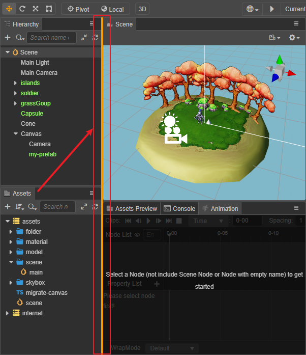
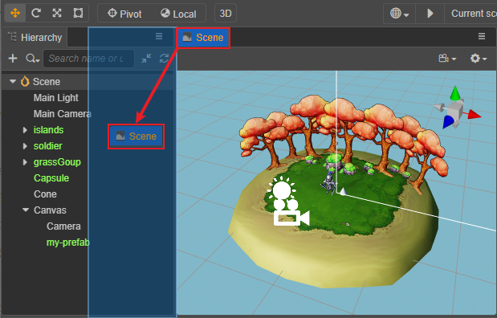
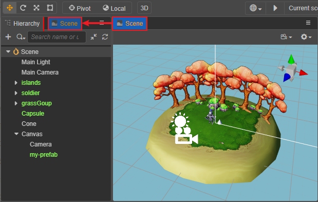
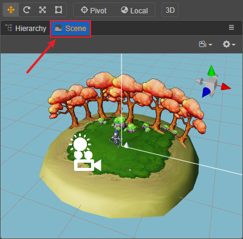
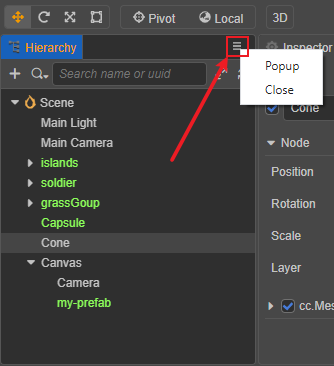

# 编辑器布局

编辑器布局是指 Cocos Creator 里各个面板的位置、大小和层叠情况。

选择主菜单里的 **Cocos Creator -> 布局** 菜单，目前只支持 **默认布局**。在默认布局的基础上，也可以继续对各个面板的位置和大小进行调节。对布局的修改会自动保存在全局目录下：

- **Windows**：`%USERPROFILE%\.CocosCreator\editor\window.json`
- **macOS**：`$HOME/.CocosCreator/editor/window.json`

## 调整面板大小

将鼠标悬浮到两个面板之间的边界线上，看到鼠标指针变成  后，按下鼠标，可以看到边界线变成了黄色，就可以拖动鼠标来修改相邻两个面板的大小。

> **注意**：部分面板设置了最小尺寸，当拖拽到最小尺寸限度后就无法再继续缩小面板了。

## 移动面板

点击面板的标签栏并拖拽，可以将面板整个移动到编辑器窗口中的任意位置。下图中红框表示可拖拽的标签栏区域，箭头表示拖拽方向：

移动面板的过程中，蓝色半透明的方框表示松开鼠标后，移动的面板将会被放置的位置。

## 层叠面板

除了移动面板位置，拖拽面板标签栏的时候还可以移动鼠标到另一个面板的标签栏区域：

在目标面板的标签栏出现红色竖线时松开鼠标，就能够将两个面板层叠在一起，同时只能显示一个面板：

层叠面板在屏幕分辨率不足，或排布使用率较低的面板时非常实用。层叠中的面板可以随时拖拽出来，恢复永远在最上的显示。

面板也支持弹出独立面板或者关闭面板操作，点击面板右上方的按钮即可。但需要注意的是 **场景编辑器** 面板不支持弹出/关闭。

