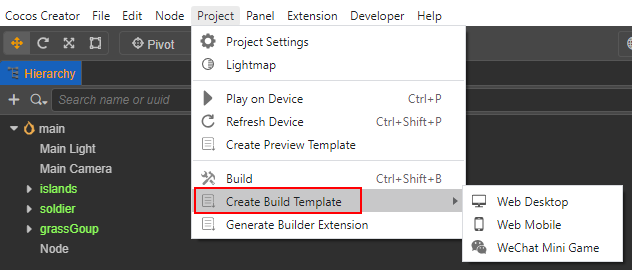
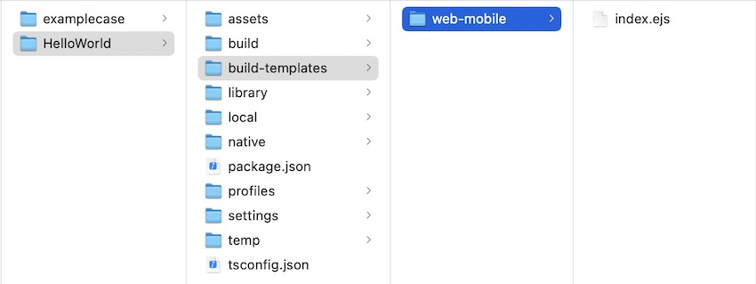

# 自定义构建模版

Cocos Creator 支持对每个项目分别定制构建模板，只需要在项目路径下添加一个 `build-templates` 目录，里面按照 **平台插件名称** 划分子目录。在构建结束后，`build-templates` 目录下所有的文件都会自动按照对应的目录结构复制到构建生成的工程中。具体的 **平台插件名称** 请参考最下方的 **自定义构建模板平台支持表**。

结构类似：

```bash
project-folder
 |--assets
 |--build
 |--build-templates
     |--web-mobile
         // 需要添加的文件，如 index.html
         |--index.html
```

这样如果当前构建的平台是 **Web Mobile** 的话，那么 `build-templates/web-mobile/index.html` 就会在构建后被拷贝到 `build/web-mobile（以平台插件名称为准）/index.html`。

除此之外，目前构建模板支持的文件类型还包括 **ejs 类型** 和 **json 类型**。各平台的支持情况，详情请参考下文的 **平台支持表**。

## ejs 类型

随着 Creator 版本的升级，可能会对构建模板做一些修改和更新，就会导致不同版本构建出来的包内容不完全一样，开发者需要手动同步更新项目中定制的构建模板。<br>
因此为了优化这个问题，Creator 在主菜单的 **项目** 中新增了 **创建项目构建模板** 选项，用于生成对应平台支持的构建模板。



开发者只需要在生成的构建模板的 `.ejs` 中进行定制，构建时会自动将编辑器构建模板的更新同步到定制的构建模板中，经常改动的内容都会同步到该模板引用的子模板（`.ejs`）中，这样定制构建模板便可以不用频繁手动更新。

以创建 Web Mobile 构建模板为例，生成的构建模板目录结构如下：



> **注意**：构建时，拷贝定制构建模板这一步骤是最后执行的，也就是说，假如该目录下同时存在 `index.ejs` 与 `index.html`，那么最终打包出来的是 `index.html` 文件而不是 `index.ejs` 文件。

## json 类型的融合处理

许多小游戏平台都会有类似 `game.json` 之类的配置文件，若这些 json 文件在对应平台的定制构建模板中，构建时便不会直接将其拷贝并覆盖到对应的发布包目录下，而是会将编辑器最新构建模板的内容整合进来。

## 自定义构建模板平台支持表

各平台对构建模板的文件类型支持情况如下表所示：

| 平台 | 平台构建插件名 | 支持的文件类型 |
| :--- | :--- | :--- |
| 华为 AGC | huawei-agc | 暂不支持 |
| 支付宝小游戏 | alipay-mini-game | `game.json` |
| 字节跳动小游戏 | bytedance-mini-game | `game.ejs`、`game.json`、`project.config.json` |
| OPPO 小游戏 | oppo-mini-game | `manifest.json` |
| 华为快游戏 | huawei-quick-game | 暂不支持 |
| Cocos Play | cocos-play |  `game.config.json` |
| vivo 小游戏 | vivo-mini-game | `project.config.json` |
| 小米快游戏 | xiaomi-quick-game | `manifest.json` |
| 百度小游戏 | baidu-mini-game | `game.json`、`project.swan.json` |
| 微信小游戏 | wechatgame | `game.ejs`、`game.json`、`project.config.json` |
| 连尚小游戏 | link-sure | 暂不支持 |
| 趣头条小游戏 | qtt | 暂不支持 |
| Web Desktop | web-desktop | `index.ejs` |
| Web Mobile | web-mobile | `index.ejs` |
| 原生平台 | native | 暂不支持 |
