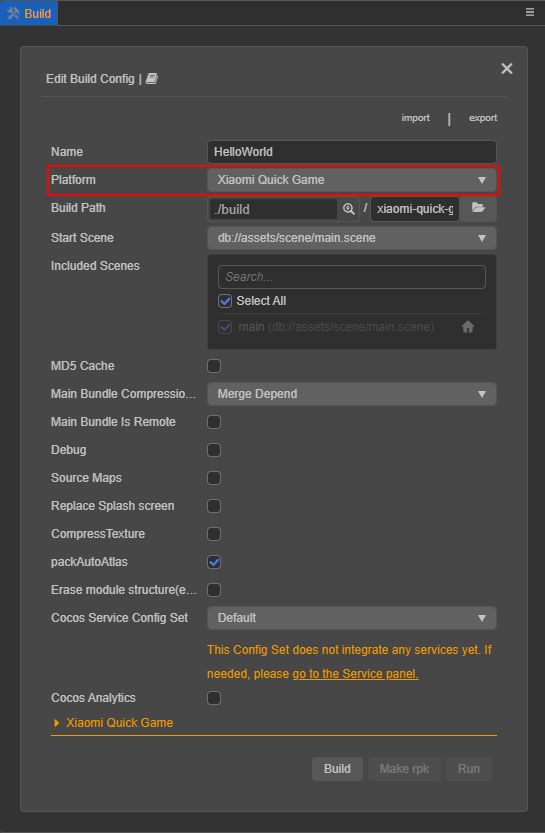
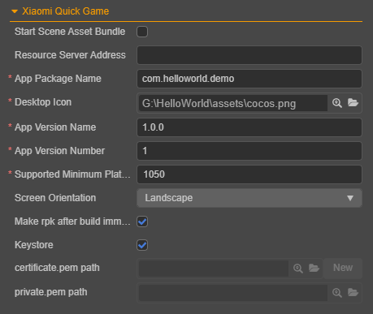
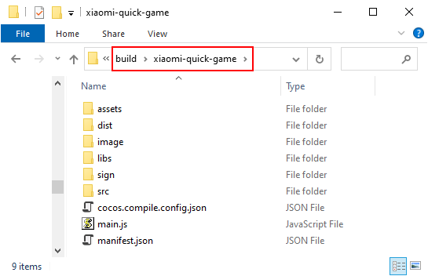
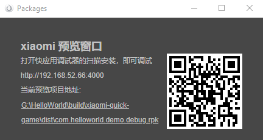

# 发布到小米快游戏

## 环境配置

- 桌面端全局安装 [Node.js](https://nodejs.org/zh-cn/download/) 8.1.4 或以上版本。
- 确保 Node.js 所带的 npm 版本最低是 **5.2.0**。升级 npm 命令如下：

  ```bash
  # 查看 npm 版本
  npm -v
  # 若 npm 版本在 5.2.0 以下，可使用以下升级命令升级 npm
  npm install npm@latest -g
  ```

- 下载 [小米快游戏调试器和小米快游戏运行环境](https://forum.cocos.org/t/topic/81887)，并安装到小米手机上（MIUI 8.5.0 或以上版本）。

## 发布流程

使用 Cocos Creator 打开需要发布的项目工程，从 **菜单栏 -> 项目** 中打开 **构建发布** 面板，**发布平台** 选择 **小米快游戏**。



通用构建选项的设置请参考 [通用构建选项](build-options.md)，小米快游戏特有的构建选项如下：



| 构建选项 | 可选 | 说明 | 字段名（用于命令行发布） |
| :------ | :--- | :--- | :--- |
| 初始场景分包 | 可选项 | 勾选后，首场景及其相关的依赖资源会被构建到发布包目录 `assets` 下的内置 Asset Bundle — [start-scene](../../asset/bundle.md#%E5%86%85%E7%BD%AE-asset-bundle) 中，提高初始场景的资源加载速度。 | `startSceneAssetBundle` |
| 资源服务器地址 | 可选项 | 该项用于填写资源存放在服务器上的地址。<br>若 **不填写** 该项，则发布包目录下的 `remote` 文件夹会被打包到构建出来的 rpk 包中。<br>若 **填写** 该项，则不会打包到 rpk 包中，开发者需要在构建后手动将发布包目录下的 `remote` 文件夹上传到所填写的资源服务器地址上。详情请参考 [上传资源到远程服务器](../../asset/cache-manager.md) 。 | `remoteServerAddress` |
| 应用包名 | 必填项 | 根据开发者的需求进行填写，例如 `com.example.demo`。 | `package` |
| 桌面图标 | 必填项 | 点击输入框后面的放大镜图标按钮选择所需的图标。构建时，图标将会被构建到 vivo 快游戏的工程中。桌面图标建议使用 **png** 图片。 | `icon` |
| 应用版本名称 | 必填项 | 应用版本名称是真实的版本，如：1.0.0 | `versionName` |
| 应用版本号 | 必填项 | **应用版本号** 与 **应用版本名称** 不同，**应用版本号** 主要用于区别版本更新。每次提交审核时应用版本号都要比上次提交审核的值至少 +1，一定不能等于或者小于上次提交审核的值，建议每次提交审核时应用版本号递归 +1。<br>**注意**：**应用版本号** 必须为正整数。 | `versionCode` |
| 支持的最小平台版本号 | 必填项 | 该项用于兼容性检查，避免上线后在低版本平台运行导致不兼容。根据小米快游戏的要求目前这个值必须大于或等于 1050。 | `minPlatformVersion` |
| 屏幕方向 | 可选项 | 设备方向，可选值包括 `landscape` 和 `portrait`。构建时会写入到发布包目录下的 `manifest.json` 中。| `deviceOrientation` |
| 构建后立即生成 rpk | 可选项 | 在构建完成后自动生成 rpk，无需手动点击 **生成** 按钮 | - |
| 密钥库 | 可选项 | 若勾选该项，表示构建 rpk 包时默认使用的是 Creator 自带的证书，仅用于 **调试** 时使用。若 rpk 包要用于提交审核，则构建时不要勾选该项。<br> 若不勾选该项，则需要手动配置签名证书。| `useDebugKey` |
| certificate.pem 路径<br>private.pem 路径 | 可选项 | 如果不勾选 **密钥库**，则需要配置签名文件 **certificate.pem 路径** 和 **private.pem 路径**，此时构建后生成的是可以 **直接发布** 的 rpk 包。开发者可通过输入框右边的放大镜图标按钮来配置两个签名文件，或者也可以参考下方的 **生成签名文件**。 | `privatePemPath`、`certificatePemPath` |

- **生成签名文件**

    有以下两种方式可以生成签名文件：

    - 通过 **构建发布** 面板 **certificate.pem 路径** 后的 **新建** 按钮生成

    - 通过命令行生成 release 签名

        用户需要通过 openssl 命令等工具生成签名文件 private.pem、certificate.pem。

        ```bash
        # 通过 openssl 命令工具生成签名文件
        openssl req -newkey rsa:2048 -nodes -keyout private.pem -x509 -days 3650 -out certificate.pem
        ```

        > **注意**：openssl 工具在 linux 或 Mac 环境下可在终端直接打开。而在 Windows 环境下则需要安装 openssl 工具并且配置系统环境变量，配置完成后需重启 Creator。

### 构建

**构建发布** 面板的构建选项设置完成后，点击 **构建** 按钮。<br>
完成后点击 **构建任务** 左下角的文件夹图标按钮打开项目发布包，可以看到在默认发布路径 `build` 目录下生成了 `xiaomi-quick-game`（以具体的构建任务名为准）文件夹，该文件夹就是导出的小米快游戏工程目录和 rpk 包。

- 若构建时勾选了 **构建后立即生成 rpk** 选项，则 rpk 包会生成在 `build/xiaomi-quick-game/dist` 目录下。
- 若构建时没有勾选 **构建后立即生成 rpk** 选项，那么在构建完成后需要点击 **构建任务** 右下角的 **生成 rpk** 按钮，来生成 rpk 包。



### 启动游戏

启动游戏，有以下两种方式：

- **方法一**：

    - 点击 **构建任务** 右下角的 **运行** 按钮，等待二维码界面生成。

       

    - 然后在小米手机上打开之前已经安装完成的 **快应用调试器**，点击 **扫码安装** 按钮，直接扫描二维码即可打开 rpk。

      

- **方法二**：

    - 首先在小米手机上打开 **设置-> 更多设置-> 开发者选项**，开启开发者选项以及 USB 调试。
    - 使用 USB 数据线将桌面端电脑与手机相连。
    - 将构建生成的快游戏 rpk 文件（位于发布包 `build/xiaomi-quick-game/dist` 目录下）拷贝到小米手机 sdcard 目录中。
    - 在小米手机上打开之前已经安装完成的 **快应用调试器**，点击 **本地安装**，然后从手机 sdcard 目录中找到 rpk 文件，选择打开即可。

      

## 调试

调试必须基于真机进行调试，并且必须严格按照先运行游戏再启动调试功能的先后顺序。<br>
启动游戏后，让小米手机处于打开游戏运行的界面。然后使用 USB 数据线将桌面端电脑与小米手机相连，并且小米手机需要开启开发者选项以及 USB 调试。

目前可以通过命令行来启动调试：

- 指定到编辑器安装目录 `resources\tools\xiaomi-pack-tools` 目录下，执行命令：`npm run debug`，就会在 Chrome 浏览器中 **自动** 启动调试界面。
- 如果想要 **手动** 打开调试界面，那么执行命令：`npm run debug -- --print-only`，然后将运行后生成的 URL 地址拷贝到 Chrome 浏览器中打开即可启动调试界⾯。

    ```bash
    # 指定到编辑器安装目录下的 resources/tools/xiaomi-pack-tools 目录下
    cd ${CocosCreator}/tools/xiaomi-pack-tools
    # 自动在 Chrome 上打开调试界面
    npm run debug
    # 手动在 Chrome 上打开调试页面
    npm run debug -- --print-only
    ```

## 分包 rpk

分包加载，即把游戏内容按一定规则拆分在几个包里，在首次启动的时候只下载必要的包，这个必要的包称为 **主包**，开发者可以在主包内触发下载其他子包，这样可以有效降低首次启动的消耗时间。

若要使用该功能需要在 Creator 编辑器中配置 [小游戏分包](subpackage.md)，设置完成后在构建时就会自动分包。

分包或者主包的包体大小限制，具体可参考 [小米快游戏分包规则](https://forum.cocos.org/t/topic/81887)。

## 小米快游戏环境的资源管理

小米快游戏与微信小游戏类似，都存在着包体限制。小米的主包包体限制是 5MB，超过的部分必须通过网络请求下载。

Cocos Creator 已经帮开发者做好了远程资源的下载、缓存和版本管理，具体的实现逻辑请参考 [资源管理](../../asset/cache-manager.md#资源下载流程)。

## 相关参考链接

- [小米快游戏相关参考链接](https://forum.cocos.org/t/topic/81887)
