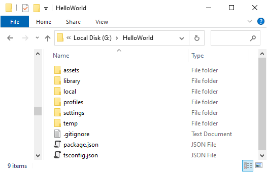

# 项目结构

通过 Dashboard，我们可以创建一个 Hello World 项目作为开始，创建之后的项目有特定的文件夹结构，我们将在这一节熟悉 Cocos Creator 项目的文件夹结构。

## 项目文件夹结构

初次创建并打开一个 Cocos Creator 项目后，开发者项目文件夹的结构如下：

- assets：资源目录

- build：构建目录（在构建某平台后会生成该目录）

- library：导入的资源目录

- local：日志文件目录

- profiles：编辑器配置

- temp：临时文件目录

- package.json：项目配置

### 资源文件夹（assets）

`assets` 用来放置游戏中所有的本地资源、脚本和第三方库文件。只有在 `assets` 目录下的内容才能显示在 **资源管理器** 中。`assets` 中的每个文件在导入项目后都会生成一个相同名字的 `.meta` 文件，用于存储对应的资源配置和索引信息。`.meta` 文件需要一并提交到版本控制系统，详见 [资源管理注意事项 --- meta 文件](../../advanced-topics/meta.md)。

一些第三方工具生成的工程或设计原文件，如 TexturePacker 的 `.tps` 文件，或 Photoshop 的 `.psd` 文件，可以选择放在 `assets` 外面管理。

### 构建目标（build）

在使用编辑器主菜单中的 **项目 -> 构建发布** 使用默认发布路径发布项目后，编辑器会在项目路径下创建 `build` 目录，并存放所有目标平台的构建工程。

### 资源库（library）

`library` 是将 `assets` 中的资源导入后生成的，在这里文件的结构和资源的格式将被处理成最终游戏发布时需要的形式。

当 `library` 丢失或损坏的时候，只要删除整个 `library` 文件夹再打开项目，就会重新生成资源库。

### 本地设置（local）

`local` 文件夹中包含该项目的本机上的配置信息，包括编辑器面板布局、窗口大小、位置等信息。开发者不需要关心这里的内容。

### 编辑器配置（profiles）

`profiles` 文件夹中包含编辑器的配置信息，包括各目标平台的构建配置信息、场景配置信息等。

### 扩展插件文件夹（extensions）

`extensions` 文件夹用于放置此项目的自定义扩展插件。如果需要手动安装扩展插件，可以手动创建该文件夹。如需卸载扩展插件，在 `extensions` 中删除对应的文件夹即可。

### 项目设置（settings）

`settings` 里保存特定项目相关的设置，如 **项目设置** 面板中相关的配置信息等。如果需要在不同开发者之间同步项目设置，请将 settings 目录加入到版本控制。

### 临时文件夹（temp）

`temp` 是临时文件夹，用于缓存一些 Cocos Creator 在本地的临时文件。这个文件夹可以在关闭 Cocos Creator 后手动删除，开发者不需要关心这里面的内容。

### package.json

`package.json` 文件和 `assets` 文件夹一起，作为验证 Cocos Creator 项目合法性的标志，只有包括了这两个内容的文件夹才能作为 Cocos Creator 项目打开。开发者不需要关心里面的内容。

## 版本控制

Cocos Creator 在新建项目时，会自动生成 `.gitignore` 文件，用于排除不应该提交到 git 仓库的文件。如果开发者使用其它版本控制系统，或者需要提交项目到其它地方，应该注意只需要提交 `assets`、`extensions`、`settings`、`package.json`，或其它手动添加的关联文件。
