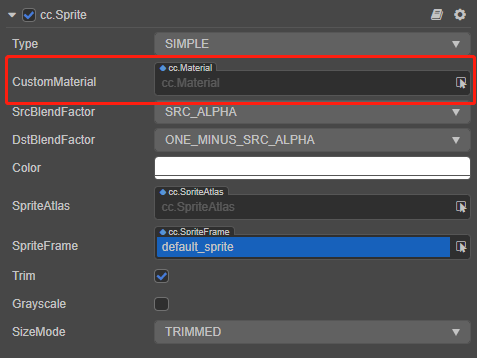

# 2D 渲染对象自定义材质

2D 渲染对象的自定义材质是拓展 2D 渲染对象表现和提升 2D 渲染对象自身能力的最佳实践，可以通过自定义材质实现溶解、外发光等酷炫的渲染效果。

3.0 版本的 2D 渲染组件大部分都支持了自定义材质的使用，其使用界面如下图（以 Sprite 组件为例）：



其使用方法与其他材质并无不同，将要使用的材质赋值给此槽位即可，但有一些需要注意的点：

1. 当设置自定义材质数量为空时，会使用内置材质进行渲染，面板功能及使用方法可参考 [Sprite](../editor/sprite.md)。
2. 2D 渲染对象并不支持多材质，自定义材质的数量最多为一个。
3. 当使用了 2D 渲染对象自定义材质之后，面板上的 Grayscale 功能将会失效，用户可选择自己在材质中实现此功能。
4. 使用了自定义材质之后，组件上的 BlendFactor 设置面板会自动隐藏且设置会失效，此时的 BlendFactor 会以自定义材质中的设置为准。
5. 使用了自定义材质之后，组件的深度检测检测信息会以材质为准，如果想要实现和 3D 物体的遮挡请使用自定义材质并开启深度检测。可参考此范例：[2d-rendering-in-3d](https://github.com/cocos-creator/test-cases-3d/tree/v3.0/assets/cases/2d-rendering-in-3d)
6. 针对自定义材质，获取上传的贴图需要在 shader 中引入 cc-sprite-texture 头文件，里头的 cc_spriteTexture 就对应在 2D 渲染组件属性面板上设置的 SpriteFrame 图片资源。例如一个简单的使用了面板设置 SpriteFrame 来采样纹理的 fragment shader 应该是下面的样子：

    ```
    CCProgram sprite-fs %{
        precision highp float;
        #include <cc-sprite-texture>
        in vec4 v_color;

        uniform ARGS{
            float time;
        };

        in vec2 uv0;
        uniform sampler2D u_normalMap;

        vec4 frag () {
            vec4 color = vec4(1, 1, 1, 1);
            color *= v_color;
            float value = 1.0;
            vec4 o = texture(u_normalMap, uv0);
            value *= o.r;
            if (value < time) {
                discard;
            }

            color *= texture(cc_spriteTexture, uv0);
            if (value < time + 0.05) {
                color = vec4(0.9, 0.6, 0.3, color.a);
            }

            return color;
        }
    }%
    ```

    

7. 如果用户希望对自定义材质进行 uniform 赋值操作，可通过获取 2D 渲染组件上的 customMaterial 来进行操作，我们提供了不同的接口以应对不同的操作情况，如下代码所示：（以 Sprite 为例）**（请一定注意看不同接口的注释说明！）**

    ```ts
    let spriteComp = this.node.getComponent(Sprite);
    // 通过 sharedMaterial 方法获取到的为 共享材质资源，针对 material 进行的操作将会影响到所有使用此材质的渲染对象,此操作不会使资源实例化，不会影响合批
    let material = spriteComp.sharedMaterial;

    // 通过 material 方法获取到的为 当前渲染组件使用的材质试例，针对 material Instance 进行的操作只会对当前组件产生影响，此操作会使资源实例化，一旦实例化，此组件无法与其他组件合批
    let materialInstance = spriteComp.material;

    ```
